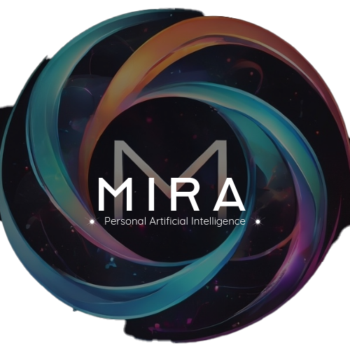

  

### Building the Future of Cognitive & Educational AI 

Hi, I'm Alan Helmick, the CTO of Mira Ai LLC, where I lead the charge in revolutionizing AI research and innovation. 

My passion lies at the intersection of **cognitive AI** and **educational AI**, with a special focus on the development of **micro models** that pack a big punch. 🚀

## 🔧 Key Areas of Expertise:
- **Cognitive AI:** Designing adaptive systems that mimic human thought patterns for problem-solving and intelligent decision-making.
- **Educational AI:** Creating tools that democratize access to knowledge and empower lifelong learning.
- **Micro Models:** Innovating efficient, scalable, and highly performant AI architectures.

## 🎯 What I’m Building:
- I’m the architect behind the Transdifferential Cognitive Architecture, a groundbreaking AI framework that enables seamless collaboration between diverse models to solve real-world challenges.
- Whether it’s improving educational outcomes or advancing cognitive capabilities, my work focuses on creating systems that amplify human potential. 🌈
- My journey began over  years ago, building my first AI model on a Hadoop cluster made of micro-computers. Today, I continue to push the boundaries of what’s possible with cutting-edge technologies like Myriad, a polymathic AI system. 🧠

## 💡 The Future of AI:
I envision a world where AI is not just a tool but a collaborative partner, working across domains to solve complex problems. My goal is to push the boundaries of what’s possible, whether through **polymathic API design**, **real-time AI orchestration**, or **cross-disciplinary innovation**. The future is bright, and I’m excited to build it with like-minded visionaries! 🌍

---

## 📚 Let’s Connect!
If you’re passionate about AI’s potential to transform cognitive and educational landscapes, let’s collaborate! Whether you’re working on a cutting-edge project or just curious about the possibilities, I’d love to connect. 🚀

- **Website:** [Mira Ai](https://miraai.ai)
- **LinkedIn:** [Alan Helmick](https://linkedin.com/in/alanchelmickjr)
- **Email:** [@Mira Ai](mailto:alan@miraai.ai) 📧

Let’s build the future of AI together!
